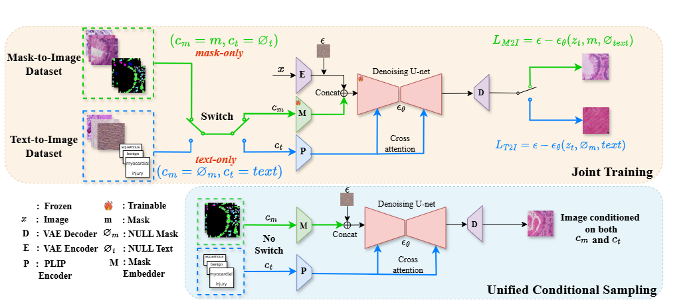
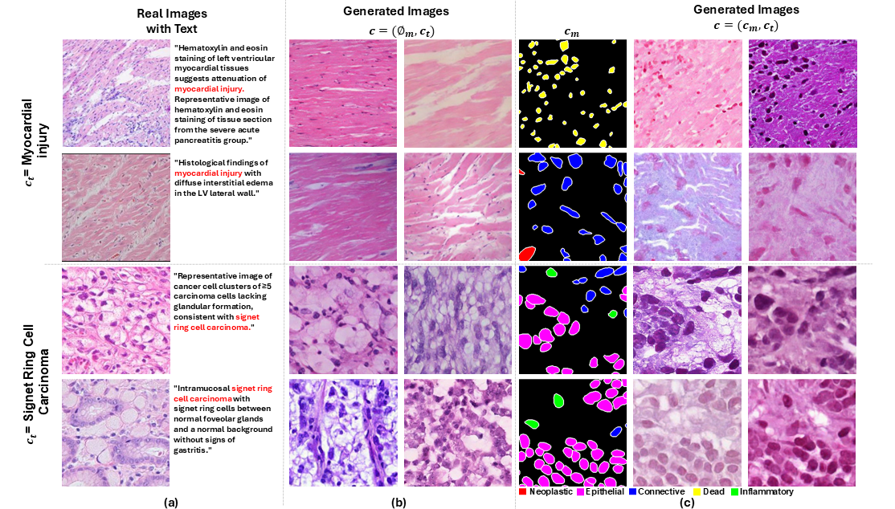

# 🚀 PathDiff : Histopathology Image Synthesis with Unpaired Text and Mask Conditions**

[Mahesh Bhosale](https://bhosalems.github.io/)<sup>1</sup>, [Abdul Wasi](https://scholar.google.com/citations?user=_2friTYAAAAJ&hl=en)<sup>1</sup>, [Yuanhao Zhai](https://www.yhzhai.com/)<sup>1</sup>, [Yunjie Tian](https://sunsmarterjie.github.io/)<sup>1</sup>, [Samuel Border](https://scholar.google.com/citations?user=6EIOlGMAAAAJ&hl=en)<sup>2</sup>, [Nan Xi](https://southnx.github.io/)<sup>1</sup>, [Pinaki Sarder](https://scholar.google.com/citations?user=BZyJ4qMAAAAJ&hl=en)<sup>2</sup>, [Junsong Yuan](https://scholar.google.com/citations?user=fJ7seq0AAAAJ&hl=en)<sup>1</sup>, [David Doermann](https://scholar.google.com/citations?user=RoGOW9AAAAAJ&hl=en)<sup>1</sup>, [Xuan Gong](https://scholar.google.com/citations?user=sTqQ-jgAAAAJ&hl=en)<sup>3</sup>

**<sup>1</sup>University at Buffalo  |  <sup>2</sup>University of Florida  |  <sup>3</sup>Harvard Medical School**


## 📖 Overview

PathDiff is a novel diffusion-based framework for generating high-quality histopathology images by jointly leveraging **unpaired** text reports and cell-type masks. Unlike prior methods that require paired annotations, PathDiff learns from two separate datasets, one with image–text pairs and one with image–mask pairs, and at inference time can synthesize images conditioned on: **Text** only or **Mask** only or **Both text & mask**.

### 📄 Abstract

Diffusion-based generative models have shown promise in synthesizing histopathology images to address data scarcity caused by privacy constraints. Diagnostic text reports provide high-level semantic descriptions, and masks offer fine-
grained spatial structures essential for representing distinct morphological regions. However, public datasets lack paired text and mask data for the same histopathological images, limiting their joint use in image generation. This constraint
restricts the ability to fully exploit the benefits of combining both modalities for enhanced control over semantics and spatial details. To overcome this, we propose PathDiff, a diffusion framework that effectively learns from unpaired mask-text data by integrating both modalities into a unified conditioning space. PathDiff allows precise control over structural and contextual features, generating high-quality, semantically accurate images. PathDiff also improves image fidelity, text-image alignment, and faithfulness, enhancing data augmentation for downstream tasks like nuclei segmentation and classification. Extensive experiments demonstrate its superiority over existing methods.

<p align="center">
  
</p>

*Figure 1. PathDiff training & inference pipeline.*


## ⚙️ Installation


```bash
git clone https://github.com/bhosalems/PathDiff.git
cd PathDiff
# create and activate a conda/env virtual environment
conda env create -f environment.yml
conda activate pathdiff
```

## 🚀 Quick Start


Download pretrained model trained jointly [here](https://drive.google.com/drive/folders/1y2vwDWGqqqn95ClFr-kT0IUCTVqrq0uy?usp=sharing). Please setup the path of the downloaded checkpoint sand configs in sampling.py. We also provide small dataset with silver standard masks on PathCap in pathcap_label_pred_small according to different pathologies. 

```bash
# Set the checkpoint and config. Let method be PathDiff and dataset be PATHCAP (trained jointly on PathCap and CONIC.)
if method == 'PathDiff':
  mask_channels = 6
  model_check_points = {
              "PanNuke": "",
              "TCGA": "",
              "CONIC": "",
              "PATHCAP": "last.ckpt" <-------- Set this
          }
    
  model_configs = {
              "PanNuke": "",
              "TCGA": "",
              "CONIC": "",
              "PATHCAP": "/configs/11-02T02-36-project.yaml" <-------- Set this
          }  

# Run Inference
python sampling.py
```


## 🖼 Qualitative Results


PathDiff integrates Text and Mask control as seen below.

<p align="center">
  
</p>


## 🔧 Scripts


```
- main.py # Run to train with your own dataset, you need to set up the config and Dataset class. Pleas take a look at the example of config in below command.
python main.py -t --base configs/latent-diffusion/mixed_cond/plip_imagenet_finetune_Mixed_control.yaml

- sampling.py # Run generation from text, mask, or both
python sampling.py

- evaluation.py # Run to sample from infer.yaml config file (functionally similar to sampling.py). You need to set up the config. Pleas take a look at the example of config in below command.
python evaluation.py --config configs/latent-diffusion/mixed_cond/plip_imagenet_finetune_mixed_control_inference.yaml --save --inference --plot

- compute_metrics.py # Run to calculate the FID, KID, PLIP score etc.
python computer_metrics.py
```


## ⚠️ Ethical Statement


This model is provided for **research and educational purposes only**. It is **not** designed, tested, or validated for clinical or diagnostic use. **Under no circumstances** should it be used to make medical decisions or inform patient care.


## 🤝 Acknowledgements


We thank authors of [PathLDM](https://github.com/cvlab-stonybrook/PathLDM), [ControlNet](https://github.com/lllyasviel/ControlNet) and [DeepCMorph](https://github.com/aiff22/DeepCMorph) for release of their code. We also thank authors of datasets we used in this work.


## 📑 Citation


```bibtex
@inproceedings{bhosale2025pathdiff,
  title     = {PathDiff: Histopathology Image Synthesis with Unpaired Text and Mask Conditions},
  author    = {Bhosale, Mahesh and Wasi, Abdul and Zhai, Yuanhao and Tian, Yunjie and Border, Samuel and Xi, Nan and Sarder, Pinaki and Yuan, Junsong and Doermann, David and Gong, Xuan},
  booktitle = {Proceedings of ICCV},
  year      = {2025}
}
```
